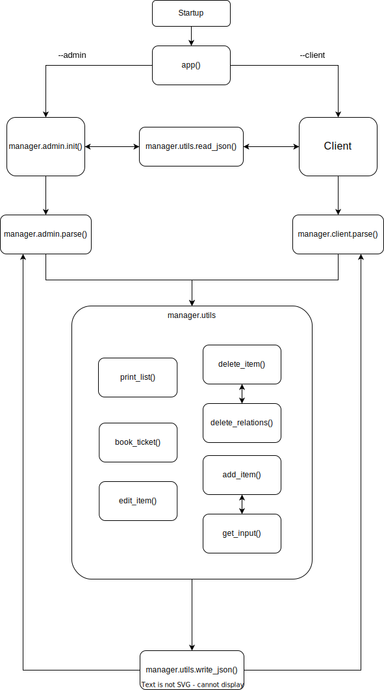
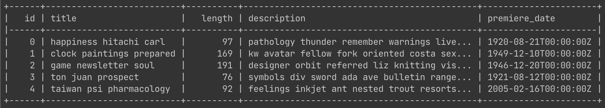

# TKO2111 kurssin harjoitustyö

Harjoitustyön aiheena on ohjelma, jonka avulla voidaan "ylläpitää" elokuvateatterin varausjärjestelmää. Sovellus voidaan käynnistää sekä käyttäjä- että ylläpitäjätilaan. Ylläpitäjä voi muokata, lisätä tai poistaa elokuvia, saleja tai näytöksiä järjestelmästä, ja käyttäjä voi puolestaan ilmoittautua näytöksiin, joissa on vapaita paikkoja. Näiden lisäksi molemmat voivat tulostaa listan elokuvateatterin saleista, elokuvista sekä näytöksistä.

### Rakenne & keskinäiset suhteet

Ohjelma koostuu kolmesta eri päämoduulista (`admin`, `client` & `utils`) sekä päämoduulien käyttämiä vakioita ja enumeraatioita sisältävästä `constants`-apumoduulista. Lisäksi `tests`-kansion sisällä on Pythonin standardikirjaston `unittest`-moduulin avulla kirjoitettuja moduulikohtaisia testejä.

Kuten illustraatiosta nähdään, käynnistyessään ohjelmisto valitsee käyttäjä- sekä ylläpitäjämoodien väliltä ohjelman jäsentelemien lippujen (`--admin` & `--client`) avulla. Tämän jälkeen ohjelma etenee valittuun moduuliin, josta se kutsuu `utils`-moduulin `read_json`-funktiota, jolle annetaan parametrina lipun (`--filename`) kautta saatu tiedostonimi. Mikäli tiedostoa ei ole tai se on tyhjä, luodaan tyhjä sanakirja pohjaksi uudelle tallennukselle.

Molemmat moduulit (`admin` & `client`) jäsentelevät käyttäjän antamia komentoja toisensa perään, kunnes käyttäjä syöttää `quit`-komennon, jolloin ohjelma sulkeutuu. Mikäli käyttäjän syöttämät komennot vastaavat jotain ohjelmaan kovakoodattua komentoa, ohjelma kutsuu komentoa vastaavaa funktiota `utils`-moduulista (esim. komento `list movies` vastaa funktion `utils.print_list` kutsumista, yhtenä funktion parametrina olisi tässä tapauksessa sanakirjan elokuvia koskeva osa-alue `data["movies"]`). Ohjelma kirjoittaa/päivittää tiedot JSON-tiedostoon jokaisen tietoja jollain tavalla muokkaavan funktiokutsun jälkeen kutsumalla `write_json`-funktiota `utils`-moduulista.

### Ulkoiset kirjastot

Ohjelmassa käytetään ulkoista [tabulate-kirjastoa](https://pypi.org/project/tabulate/). Kirjastoa käytetään tietojen taulukkomaiseen tulostamiseen alla olevan esimerkin mukaisesti.

Ohjelmassa käytetyn version kirjastosta voi asentaa komennolla `python3 -m pip install -r requirements.txt` esimerkiksi eristettyyn virtualenv-ympäristöön.
